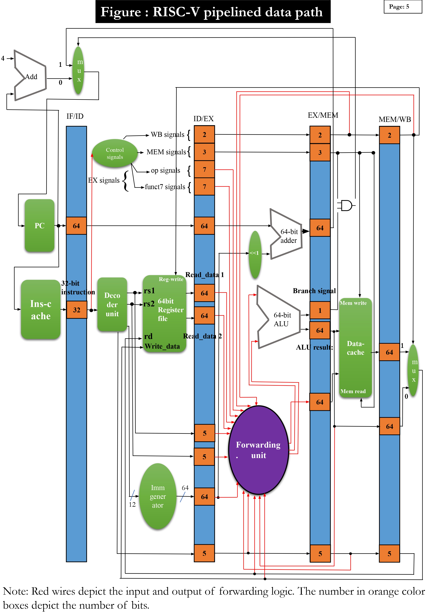

# 🚀 5-Stage RISC-V Pipeline

Welcome, folks! 👋🏻  
This repository contains a **highly sophisticated Verilog code** for designing a **5-stage 64-bit RISC-V pipeline**. During this project, I not only mastered Verilog but also honed my skills in hardware design. Below, you'll find everything you need to know about this advanced project.

---

## 🎯 Key Highlights

- **Advanced Verilog Implementation**: Precision-crafted Verilog code for 64-bit RISC-V pipeline.
- **Hardware Expertise**: Gained hands-on experience in hardware design.
- **Optimized Pipelining**: Efficient use of forwarding logic to minimize stalls.

---

## 🛠️ Project Architecture

Here's a glimpse of the architecture (Check out page 5 from the project report):  
*_"A picture is worth a thousand words!"_*

---

## 📂 Table of Contents

| 📁 File | 📝 Description |
|:--------|:--------------|
| [verilog_code.v](verilog_code.v) | Verilog code of the 5-stage RISC-V pipeline |
| [test-bench.v](test-bench.v) | Test bench to verify the machine code output |
| [project_report.pdf](project_report.pdf) | Detailed project report |

---

## 💡 Problem Statement

Design a **5-stage RISC-V pipelined data path** with the following features:

- 🗃️ Store and access data efficiently.
- ➕ Perform arithmetic operations like `add`, `sub`, `mul`, and `addi`.
- 🚀 Implement forwarding logic to reduce stalls and enhance performance.

---

## 🧠 Introduction to RISC-V Architecture

**RISC-V** is an open-source Instruction Set Architecture (ISA) designed for computer processors. It stands for **"Reduced Instruction Set Computer - Five"** and is known for its simplicity and efficiency, which comes from using a smaller set of instructions. RISC-V is widely used in cloud computing, servers, and embedded systems.

---

## 📏 Guiding Design Principles in RISC-V ISA

1. **Simplicity** favors regularity.
2. **Smaller** is faster.
3. **Good design** demands good compromises.

---

## 🌀 Pipelining and Instruction Level Parallelism

### 🔄 What is Pipelining?

**Pipelining** is a powerful technique used in computer architecture to enhance performance by overlapping the execution of instructions. Think of it like an assembly line in a factory where different stages of production occur in parallel. In the context of a RISC-V processor, pipelining divides the execution of an instruction into several distinct stages, each of which can be processed simultaneously with different instructions.

### ⚙️ The 5 Stages of RISC-V Instruction Execution:

1. **Instruction Fetch (IF)**: The processor fetches the instruction from memory.
2. **Instruction Decode (ID)**: The fetched instruction is decoded to understand what action needs to be performed, and the necessary operands are read from the register file.
3. **Execute (EX)**: The decoded instruction is executed, performing operations like addition, subtraction, or memory address calculation.
4. **Memory Access (MEM)**: If the instruction involves memory operations (like load or store), the memory is accessed in this stage.
5. **Write Back (WB)**: The result of the execution is written back to the register file, completing the instruction.

### 🚀 Why Pipelining in Computer Architecture?

Execution time = **IC** × **CPI** × **T**

- **IC** – Instruction Count
- **CPI** – Cycles Per Instruction
- **T** – Clock Period

In a single-cycle processing unit, instructions are executed sequentially, one after the other. Though the CPI (Cycles Per Instruction) is low (1 instruction = 1 cycle), the clock period is long (slowest instruction dictates the clock period). This leads to significantly increased execution time and reduced performance.

**Single Cycle Processing Unit:**  
- **CPI**: 1  
- **Clock Period**: IF_time + ID_time + EX_time + MEM_time + WB_time  
  (long clock period, critical path: ld instruction)

---

### 🧩 Instruction Level Parallelism (ILP)

**Instruction Level Parallelism (ILP)** refers to the ability of a processor to execute multiple instructions simultaneously within a single clock cycle. By overlapping the execution of instructions, ILP seeks to maximize the utilization of available resources and improve overall performance.

### 🔍 How ILP Works:
1. **Independent Operations**: ILP identifies instructions that do not depend on the results of others and can therefore be executed in parallel. For example, while one instruction reads from memory, another can perform an arithmetic operation.

2. **Hardware Support**: Modern processors are equipped with multiple functional units, such as arithmetic logic units (ALUs), memory access units, and branch units, which can execute different parts of instructions simultaneously.

3. **Pipeline Parallelism**: Each stage of the pipeline (fetch, decode, execute, etc.) works on a different instruction, enabling multiple instructions to be in various stages of execution at the same time.

### 💡 Benefits of ILP:
- **Increased Throughput**: By executing more than one instruction per clock cycle, ILP significantly boosts the throughput of the processor.
- **Reduced Latency**: Parallel execution shortens the time taken to complete a sequence of instructions, reducing the overall latency.

### 📉 Challenges of ILP:
- **Data Hazards**: When instructions depend on each other's results, managing these dependencies without stalling the pipeline becomes complex.
- **Control Hazards**: Branch instructions can disrupt the flow of the pipeline, as the outcome of the branch may not be known until later stages.
- **Resource Conflicts**: Multiple instructions competing for the same hardware resources can create bottlenecks.

---

For more details, please refer to the [project report](project_report.pdf).

--- 

Hope you enjoy exploring this project as much as I did building it! 🚀

---
